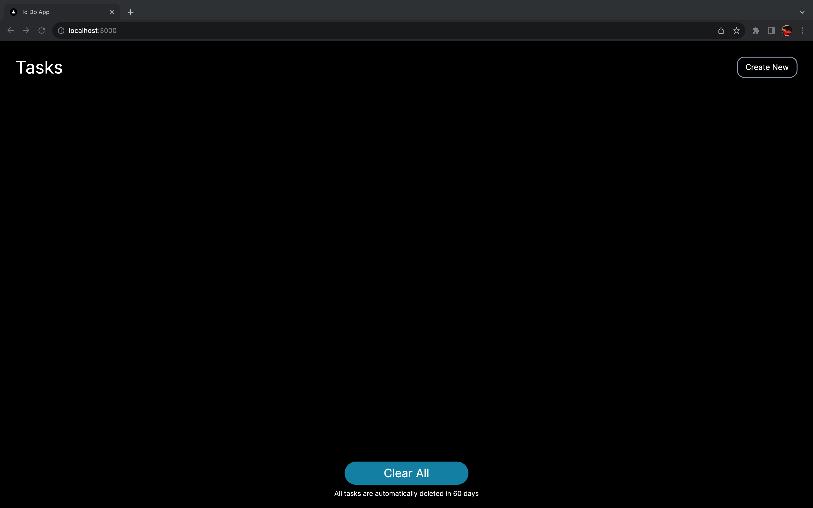
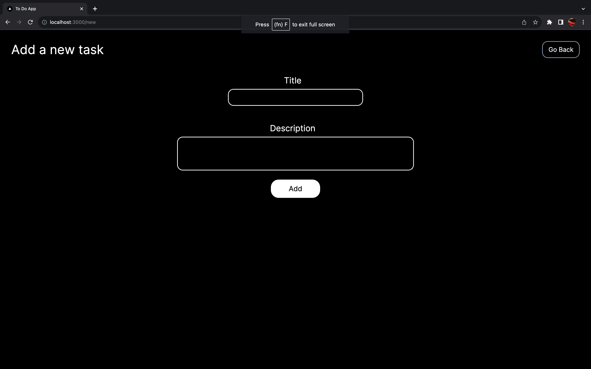
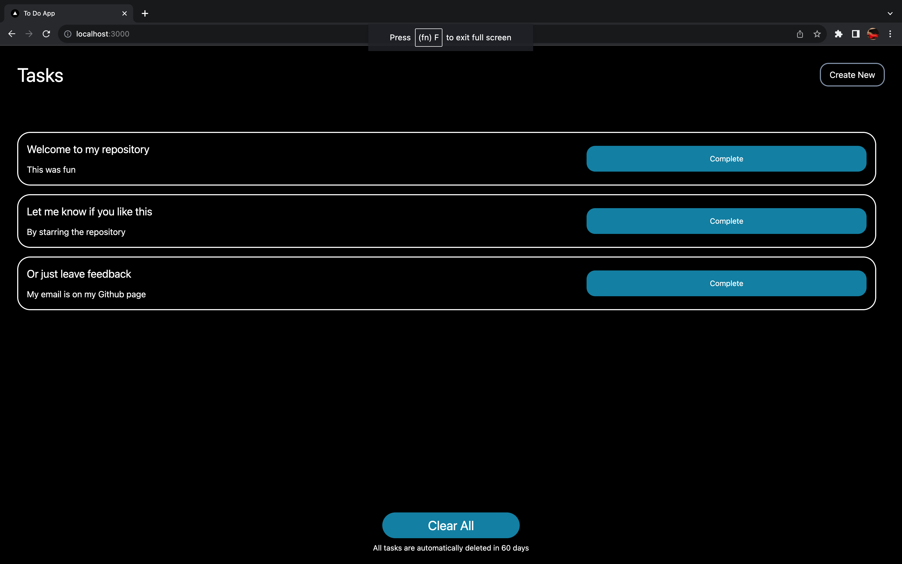
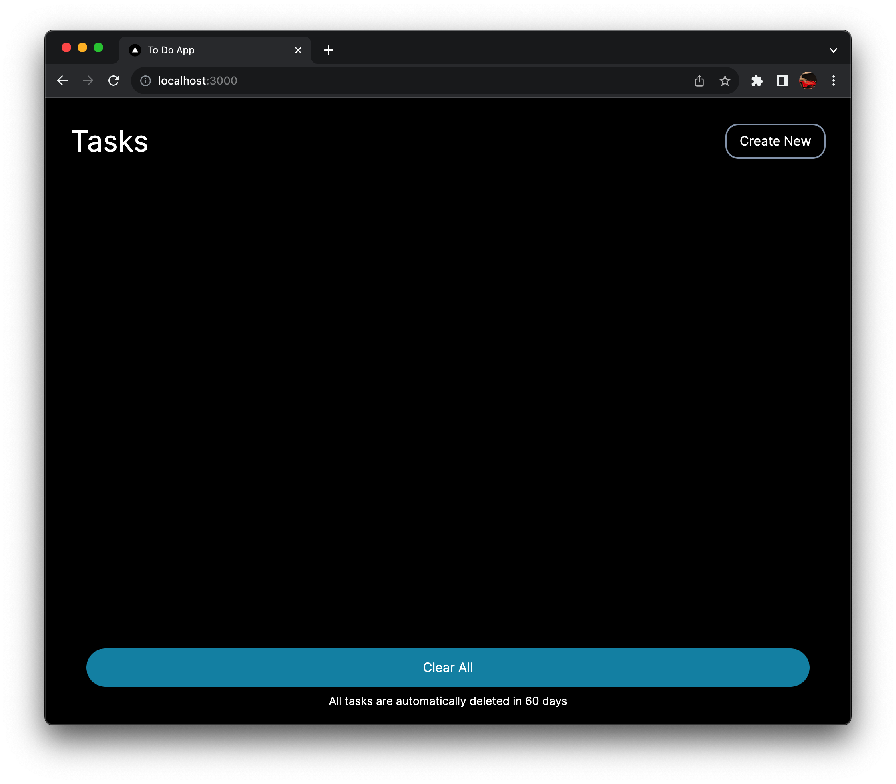
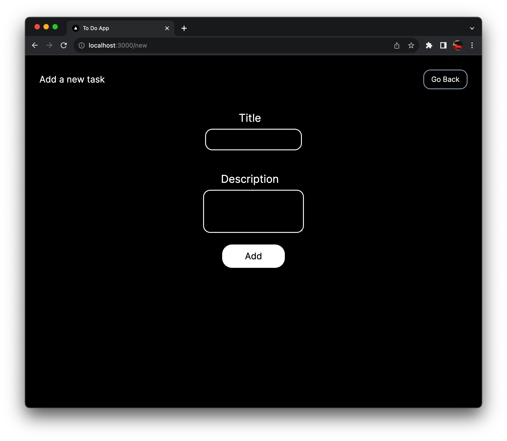
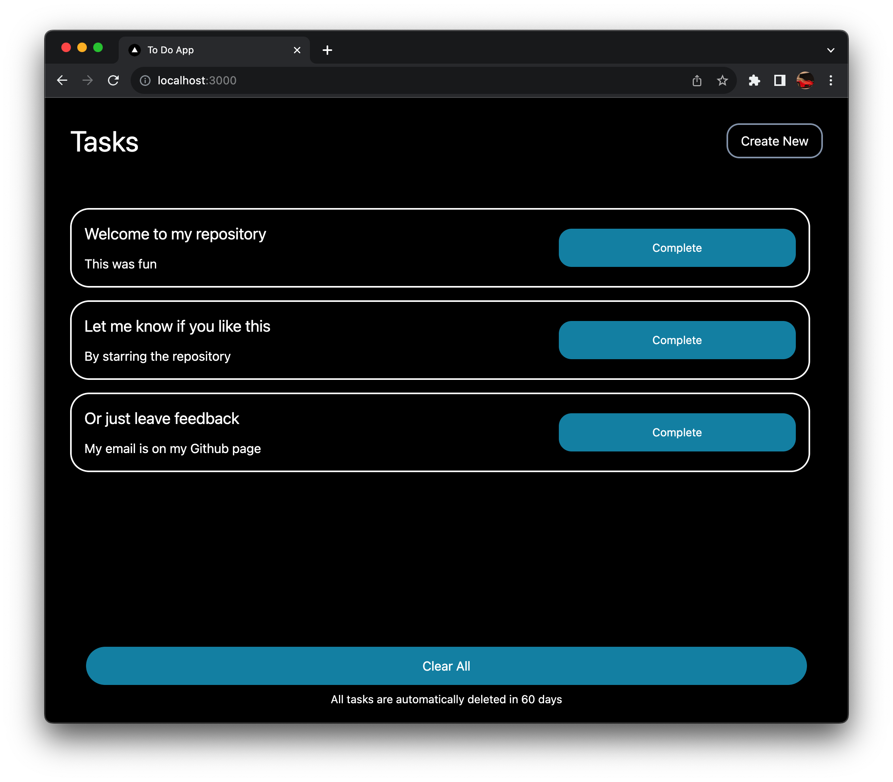
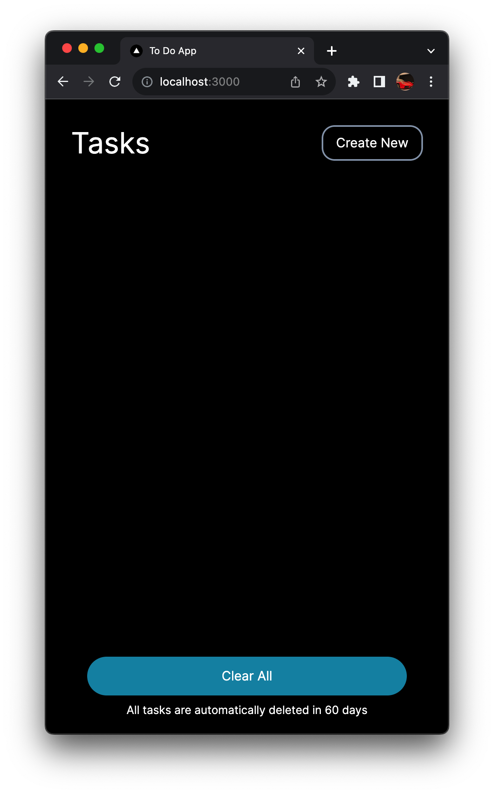
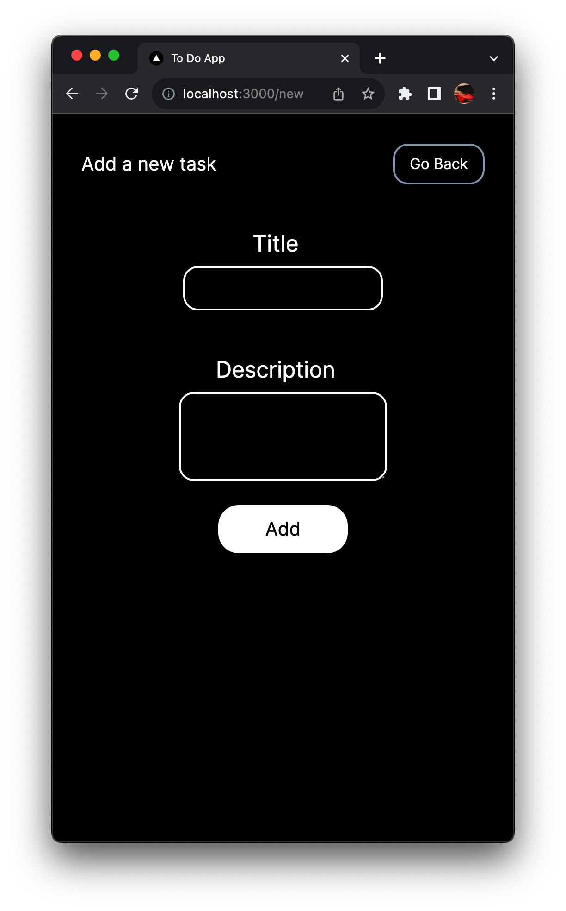
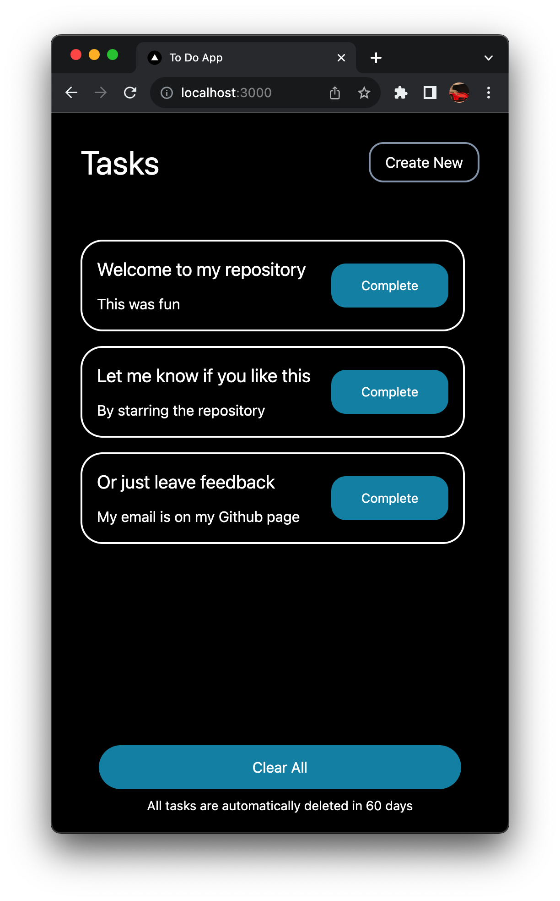

# A To Do App in NextJS

This is a simple To Do App built with NextJS and TailwindCSS. It is my first try at making something in NextJS, and I love it. Just a small note, this app has not been tested on multiple devices. It has been developed on a 13 inch Mac, so there might be some issues with placements on other devices. Raise issues if you find any and I will try my best to fix them asap.

This app stores evverything on your local storage, so you don't have to worry about losing your data. Just make sure you don't clear your local storage.

## How to run

1. Clone the repo
2. Run `npm install`
3. Run `npm run build`
4. Run `npm run start`

## How to contribute

1. Fork the repo
2. Make changes with commits
3. Raise a PR

## Screenshots

### Large Screens

### Medium Screens

### Small Screens

